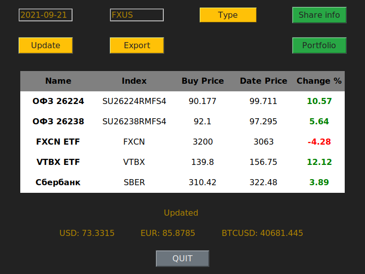

# Image generator
  
GUI App for request and show russian shares market and currency data.  
## Features
- request and show share or currency data for input date.
- request and show data about bunch of shares (portfolio) stored in config.
- show difference from share buy price to share price for input date.
- save request data for future using.
- by default, start with updating shares from portfolio for last weekday.
- main module may be used without GUI
- may be extended by adding modules for shares.
